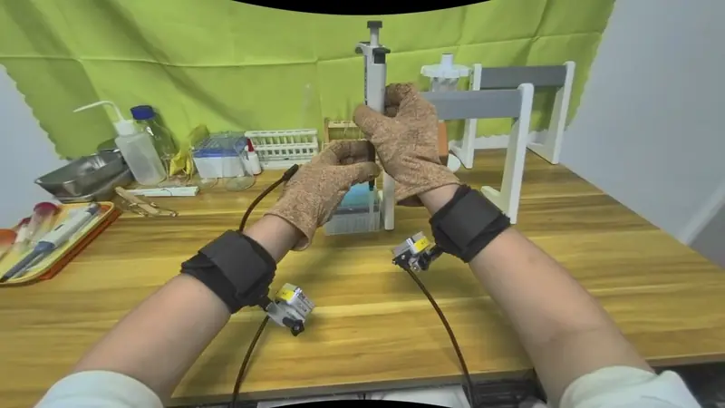

<h2 align="center"><a href="https://touch-scale.github.io/">TouchScale: 500 Hours of Human Vision and Touch for Visual–Tactile Learning</a></h2>

<p align="center">
Dayou Li<sup>1,*</sup>, Hao Wang<sup>2,*</sup>, Qianqian Yang<sup>3,*</sup>, Zihao Zhu<sup>1,*</sup>, Haoquan Fang<sup>4</sup>, Ziyao Zeng<sup>5</sup>, Yan Han<sup>6</sup>, Zihan Wang<sup>7</sup>, Yan Wang<sup>8</sup>,
Baoru Huang<sup>9</sup>, Dilin Wang<sup>10</sup>, Kenji Shimada<sup>3</sup>, Yiyue Luo<sup>11</sup>, Manling Li<sup>12</sup>, Teresa Lv<sup>13</sup>, Mustafa Mukadam<sup>11</sup>, Rakesh Ranjan<sup>10</sup>,
Ruohan Zhang<sup>4</sup>, Qi He<sup>6</sup>, Changliu Liu<sup>3</sup>, Xu Chen<sup>11</sup>, Marco Pavone<sup>4,8</sup>, Bangya Liu<sup>7</sup>, Jiachen Li<sup>14</sup>, Masayoshi Tomizuka<sup>15</sup>, Zhiwen Fan<sup>1,†</sup>
</p>

<p align="center">
<sup>1</sup>Texas A&amp;M University&nbsp;&nbsp; <sup>2</sup>Google DeepMind&nbsp;&nbsp; <sup>3</sup>CMU&nbsp;&nbsp; <sup>4</sup>Stanford University&nbsp;&nbsp; <sup>5</sup>Yale University&nbsp;&nbsp;
<sup>6</sup>Microsoft&nbsp;&nbsp; <sup>7</sup>Overfit Lab&nbsp;&nbsp; <sup>8</sup>NVIDIA&nbsp;&nbsp; <sup>9</sup>University of Liverpool&nbsp;&nbsp; <sup>10</sup>Meta&nbsp;&nbsp;
<sup>11</sup>University of Washington&nbsp;&nbsp; <sup>12</sup>Northwestern University&nbsp;&nbsp; <sup>13</sup>Sony&nbsp;&nbsp; <sup>14</sup>Georgia Tech&nbsp;&nbsp; <sup>15</sup>UC Berkeley
<br>
<sup>*</sup>Equal contribution&nbsp;&nbsp; <sup>†</sup>Corresponding author
</p>

<h5 align="center">

[](https://arxiv.org/abs/2610.10288) [](https://huggingface.co/datasets/2077AIDataFoundation/TouchScale)
[](https://touch-scale.github.io/) [](https://www.overfitlab.ai/research/touchscale)
</h5>

<div align="center">
This repository is the official code release for TouchScale, a 500-hour egocentric visual–tactile dataset of everyday human manipulation,
recorded with a wearable RGB-D camera, two wrist cameras, and bimanual tactile gloves.
</div>
<br>

<p align="center">
  <a href="https://touch-scale.github.io/"></a>
  <br>
  <em>500 hours across laboratories, kitchens, workbenches, and everyday environments.</em>
</p>

## Overview

TouchScale is a large-scale egocentric visual-tactile dataset of everyday
manipulation, recorded in laboratories, kitchens, workbenches, and other
everyday environments. A single wearable setup records:

- a head-mounted **RGB-D camera** for the overall interaction,
- two **wrist-mounted RGB cameras** for close views of hand-object contact (both at 30 Hz),
- bimanual **tactile gloves**, each with 880 taxels across the five fingers and
  palm at under 2 mm spatial resolution, recording normal and shear force.

Mid-training on TouchScale teaches a policy to predict how touch will change
before robot post-training. In real-robot experiments this raised task success
from 22.5% to 57.5% on contact-rich tasks (soft/hard sorting, bottle-cap removal,
test-tube transfer, whiteboard wiping). Scaling the data also improves zero-shot
tactile contact prediction and egocentric action recognition.

## Repository contents

| Path | Description |
|---|---|
| [`qc/`](qc/) | The automatic data-quality pipeline used to screen recordings: a timestamp sync gate across all six sensor streams, and a VLM-assisted check for missing tactile signal and baseline noise. See [`qc/README.md`](qc/README.md). |

## Quick start (QC)

```bash
cd qc
pip install -r requirements.txt          # requires ffmpeg / ffprobe
python check_sync.py --root /path/to/recordings
cp .env.example .env                     # add a Gemini API key for the tactile QC stage
python run_qc.py --data /path/to/recordings --out qc_out
```

## License

Code in this repository is released under the [MIT License](LICENSE), with one exception: the `n0-vtla/` directory is derived from [NeoteAI's N0-VTLA](https://github.com/neoteai/N0-VTLA) and remains under its original [CC BY-SA 4.0 license](n0-vtla/LICENSE) (third-party notices in `n0-vtla/NOTICE` and `n0-vtla/LICENSES/`). The N0-VTLA model weights are governed by the Gemma Terms of Use.

## Citation

If you find TouchScale useful in your research, please cite:

```bibtex
@misc{li2026touchscale500hourshuman,
      title={TouchScale: 500 Hours of Human Vision and Touch for Visual-Tactile Learning},
      author={Dayou Li and Hao Wang and Qianqian Yang and Zihao Zhu and Haoquan Fang and Ziyao Zeng and Yan Han and Zihan Wang and Yan Wang and Baoru Huang and Dilin Wang and Kenji Shimada and Yiyue Luo and Manling Li and Teresa Lv and Mustafa Mukadam and Rakesh Ranjan and Ruohan Zhang and Qi He and Changliu Liu and Xu Chen and Marco Pavone and Bangya Liu and Jiachen Li and Masayoshi Tomizuka and Zhiwen Fan},
      year={2026},
      eprint={2610.10288},
      archivePrefix={arXiv},
      primaryClass={cs.CV},
      url={https://arxiv.org/abs/2610.10288},
}
```
